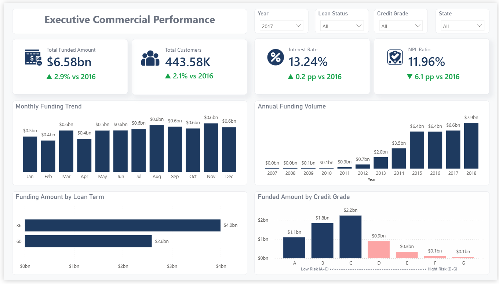
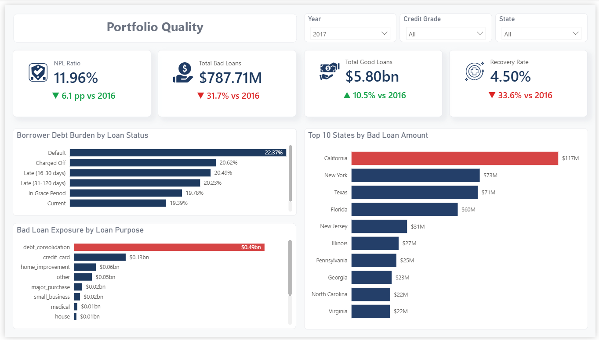
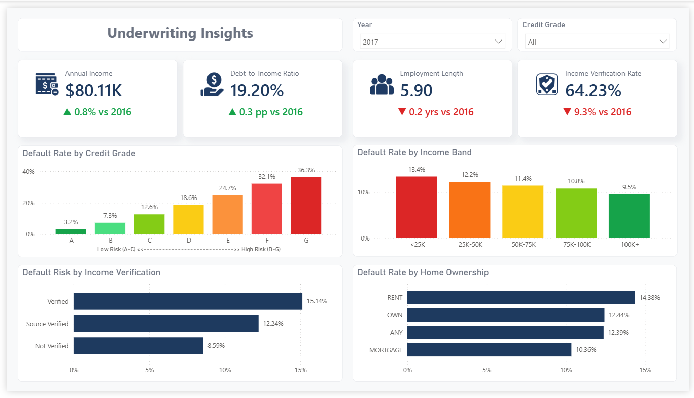

# End-to-End Credit Risk Analytics Platform

<p align="center">
  
</p>

Built an end-to-end credit risk analytics solution using SQL ETL, dimensional modeling, and Power BI to analyze 2.26M Lending Club loan records.

## Project Snapshot

| Metric | Value |
|----------|----------|
| Records Processed | 2.26 Million |
| Dataset Size | >1 GB |
| Power BI Model | 95.5 MB |
| DAX Measures | 61 |
| Architecture | Bronze → Silver |
| Dashboard Pages | 3 |

A complete credit risk analytics project built using Lending Club loan data, covering the full workflow from raw data ingestion, SQL-based ETL development, dimensional modeling, and interactive Power BI reporting.

The project processes more than **2.26 million loan records** and demonstrates how raw financial data can be transformed into an analytics-ready dataset for portfolio monitoring, risk assessment, and business decision-making.

---

## Project Overview

Financial institutions need reliable visibility into loan portfolio performance in order to identify risk exposure and improve lending decisions.

This project focuses on answering questions such as:

* Which borrowers contribute most to bad loans?
* How does borrower income affect repayment behavior?
* Which credit grades have the highest default rates?
* What is the overall health of the lending portfolio?

The solution was developed using a two-layer Medallion Architecture:

```text
Raw CSV Data
    ↓
Bronze Layer
(master_lending_club)
    ↓
SQL ETL & Data Validation
    ↓
Silver Layer
(fact_loan_analytics)
    ↓
Power BI Semantic Model
    ↓
Executive Dashboard
```

---

## Dataset

Source:

Lending Club Loan Dataset (Kaggle)

Dataset Link:

https://www.kaggle.com/datasets/adarshsng/lending-club-loan-data-csv

Dataset Statistics:

| Metric                   | Value     |
| ------------------------ | --------- |
| Total Records            | 2,260,668 |
| Raw Dataset Size         | >1 GB     |
| Power BI Model Size      | 95.5 MB   |
| DAX Measures             | 61        |
| Selected Business Fields | 20        |
| Final Analytical Columns | 22        |

---

## Architecture

The project follows a simplified Medallion Architecture.

### Bronze Layer

Table:

```sql
master_lending_club
```

Purpose:

* Store raw imported data
* Preserve source integrity
* Support future reprocessing

Characteristics:

* Raw CSV ingestion
* VARCHAR/TEXT dominant schema
* Minimal transformation

### Silver Layer

Table:

```sql
fact_loan_analytics
```

Purpose:

* Cleaned analytical dataset
* Standardized business attributes
* Reporting-ready structure

Characteristics:

* Typed columns
* Date standardization
* Risk classification
* Feature engineering

Additional documentation:

* docs/architecture_notes.md
* docs/data_quality_report.md

---

## Data Engineering Process

### 1. Raw Data Ingestion

Imported Lending Club data into MySQL using a dedicated Bronze Layer table.

To avoid ingestion failures caused by inconsistent source data, columns were initially stored as text-based fields.

### 2. Data Profiling

Performed exploratory audits to identify data quality issues.

Key findings:

* 2,260,668 total records
* Missing identifier fields
* Empty income values
* Non-standard date formats
* Text-based numerical fields

### 3. ETL Transformation

Built a SQL pipeline to transform raw data into an analytics-ready model.

Main transformations included:

* NULL handling
* Data sanitization
* Type conversion
* Date standardization
* Employment length parsing
* Customer ID generation
* Credit risk classification

Example generated customer ID:

```text
CUST-000001
CUST-000002
CUST-000003
```

---

## Dashboard Preview

### Executive Commercial Performance


Provides an overview of portfolio growth, funded amount, customer volume, and portfolio performance.

---

### Portfolio Quality



Focuses on loan quality, default exposure, recovery performance, and geographic risk distribution.

---

### Underwriting Insights



Analyzes borrower characteristics including income bands, credit grades, verification status, and home ownership.

---

## Data Model

The Power BI solution uses a star schema design.

Main Components:

```text
Fact Table:
fact_loan_analytics

Dimensions:
DimDate
DimState

Measures:
_Key Metrics
```

The semantic model contains:

* 61 DAX Measures
* Time Intelligence Calculations
* Portfolio KPIs
* Credit Risk Metrics

---

## Portfolio Validation

Final validation was performed directly from the Silver Layer.

| Risk Category | Borrowers | Avg Annual Income |  Funded Amount |
| ------------- | --------: | ----------------: | -------------: |
| Good Loan     | 1,963,631 |        $79,017.32 | $29.35 Billion |
| Bad Loan      |   297,033 |        $71,217.03 |  $4.66 Billion |

---

## Key Findings

### Income Matters

Borrowers classified as Bad Loan have a lower average annual income than Good Loan borrowers.

### Credit Grade Drives Risk

Default rates increase significantly as credit quality decreases from Grade A to Grade G.

### Debt Consolidation Is the Largest Risk Segment

Debt consolidation loans contribute the largest share of bad loan exposure.

### Home Ownership Shows Different Risk Profiles

Borrowers who rent tend to show higher default rates than mortgage holders.

### Geographic Risk Varies

Certain states contribute disproportionately to bad loan balances and default exposure.

---

## Repository Structure

```text
.
├── dataset/
│   ├── README.md
│   └── Sample_dataset.csv
│
├── docs/
│   ├── architecture_notes.md
│   ├── business_requirements.md
│   ├── data_dictionary.md
│   └── data_quality_report.md
│
├── images/
│   ├── executive_dashboard.png
│   ├── portfolio_quality.png
│   └── underwriting_insights.png
│
├── powerbi/
│   └── README.md
│
├── sql_script/
│   ├── bronze_layer_setup.sql
│   ├── data_profiling.sql
│   └── silver_layer_etl.sql
│
└── README.md
```

---

## Tools Used

* MySQL
* DBeaver
* Power BI
* DAX
* SQL
* Star Schema Modeling
* Data Quality Auditing
* ETL Development

---

## Skills Demonstrated

### Data Engineering

- SQL ETL Development
- Data Cleaning & Transformation
- Data Profiling & Validation
- Data Quality Assessment
- Medallion Architecture Design

### Data Modeling

- Star Schema Modeling
- Fact & Dimension Design
- Surrogate Key Implementation
- Analytical Data Structures

### Business Intelligence

- Power BI Dashboard Development
- DAX Measure Development
- KPI Design
- Time Intelligence Analysis
- Executive Reporting

### Analytics & Domain Knowledge

- Credit Risk Analytics
- Loan Portfolio Analysis
- Underwriting Insights
- Financial Data Analysis
- Business Recommendation Development
